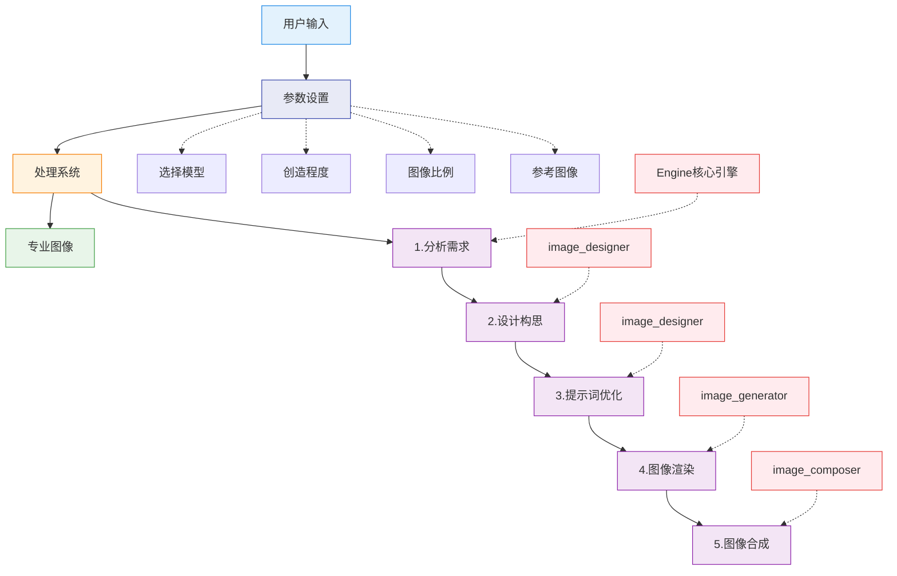
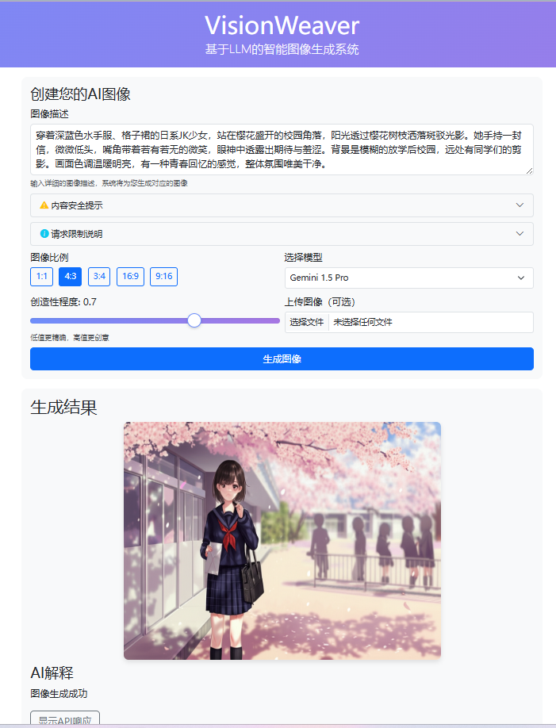

# VisionWeaver - AI文生图工具

VisionWeaver是一款智能AI文生图工具，类似于"豆包"、"AI生图"等服务，可以将简单的文本描述直接转化为高质量图像。不同于其他简单的提示词生成工具，VisionWeaver通过多阶段处理和智能任务分解，生成更符合专业设计需求的图像作品。

🔍 **在线演示**: [https://vw.hehuanju.com.cn/demo](https://vw.hehuanju.com.cn/demo)

## 它是如何工作的



整个过程类似于与专业设计师协作，而非仅仅输入提示词。用户可以通过简单的界面操作：

1. **填写图像描述**：输入您想要生成的图像描述
2. **选择模型与参数**：
   - 选择 Gemini 1.5 Pro 或 Flash 模型
   - 调整创造性程度 (0.1-1.0)
   - 选择输出图像比例 (1:1、4:3、16:9等)
   - 可选择上传参考图像
3. **生成与等待**：系统会按照以下流程处理您的请求
   - 分析需求（由Engine核心引擎处理）
   - 设计构思（由image_designer组件处理）
   - 提示词优化（由Engine和image_designer共同处理）
   - 图像渲染（由image_generator组件处理）
   - 图像合成（由image_composer组件处理）
4. **获取结果**：系统生成高质量专业图像，并提供AI对生成结果的解释

## 技术栈与依赖

| 组件 | 技术 | 版本 | 用途 |
|------|------|------|------|
| **核心框架** | LangChain | 0.1.0+ | 构建LLM应用和工具调用 |
|  | LangGraph | 0.0.20+ | 实现多阶段工作流程和状态管理 |
|  | FastAPI | 0.104.0+ | 构建REST API服务 |
|  | Asyncio | Python 3.10+ | 处理异步任务和并发 |
| **模型** | Gemini-1.5-Pro | Google API | 高质量图像生成 |
|  | Gemini-1.5-Flash | Google API | 快速图像生成 |
| **存储** | Aliyun OSS | SDK 2.7.0+ | 图像存储和分发 |
| **其他** | Pillow | 10.0.0+ | 图像处理和合成 |
|  | aiohttp | 3.8.5+ | 异步HTTP请求 |
|  | Redis | 7.0+ | 请求限制和队列管理 |

## 内容安全与请求限制

### 内容安全

为保障平台安全，系统会自动过滤并拒绝包含以下内容的请求：

* 违法犯罪相关内容（如毒品、武器、犯罪行为等）
* 暴力、血腥、恐怖内容
* 色情、赌博等不良内容
* 试图规避过滤的行为（如使用特殊字符分隔敏感词）

违反规定的请求将被系统自动拦截并返回403错误。

### 请求限制

为确保服务质量，系统实施了以下限制：

* 同一时间只允许处理一个图像生成请求
* 如有其他用户正在生成图像，您的请求将被暂时排队
* 生成过程通常需要30-60秒，请耐心等待

当系统繁忙时，您可能会收到429错误，请稍后再试。

## 核心功能与优势

✅ **智能图像设计**：不只是生成图像，而是提供专业设计方案  
✅ **多轮优化**：通过分阶段处理提升图像质量  
✅ **中文理解**：深度理解中文表达和文化元素  
✅ **图像合成**：支持添加水印、logo或二维码  
✅ **API与CLI双接口**：灵活对接各类应用场景  
✅ **速率限制管理**：智能处理API请求频率，避免额度浪费

## 快速上手

### 1. 在线演示

访问 [VisionWeaver在线演示](https://vw.hehuanju.com.cn/demo) 可直接体验：

1. 在文本框中输入详细的图像描述
2. 选择模型（Gemini 1.5 Pro或Flash）
3. 调整创造性程度（默认0.7）
4. 选择图像比例（1:1、4:3、3:4、16:9、9:16）
5. 可选择上传参考图像
6. 点击"生成图像"按钮
7. 等待30-60秒，查看生成结果及AI解释

### 2. 安装部署

```bash
# 克隆仓库
git clone https://github.com/hehuanju/VisionWeaver.git
cd VisionWeaver

# 安装依赖
pip install -r requirements.txt
```

### 3. 配置

创建`.env`文件并设置API密钥:

```
GOOGLE_API_KEY=your_api_key_here
ALIYUN_ACCESS_KEY=your_access_key
ALIYUN_SECRET_KEY=your_secret_key
ALIYUN_BUCKET_NAME=your_bucket_name
REDIS_URL=redis://localhost:6379/0
```

### 4. 运行

**命令行方式**：

```bash
# 交互模式
python run_agent.py

# 单次查询
python run_agent.py -q "设计一张春节团圆主题的贺卡"

# 文件输入（适合复杂需求）
python run_agent.py -f 设计需求.txt

# 合成logo到生成图片
python run_agent.py -q "设计一张企业宣传海报" --image logo.png

# 控制API请求速率（应对限流）
python run_agent.py --rpm 0.5  # 每120秒一次请求
```

**API服务**:

```bash
uvicorn app.main:app --reload
```

API文档访问: http://localhost:8000/docs

## 运行示例

下图展示了从输入到输出的完整流程，包括需求分析、设计方案生成和最终结果：



## 性能与限制

- **响应时间**：完整生成一张图像约15-30秒
- **图像质量**：1024×1024像素标准分辨率
- **API用量**：每次请求消耗1-2次API调用
- **限制**：
  - 免费版Google API每分钟限制2次请求
  - 每天最多50次请求
  - 不支持NSFW内容

## 未来规划

本项目将在三周内实现MCP化（Multi-Chain Programming），重点改进：

1. 将单一工作流拆分为多个独立Chain（需求分析链、设计链、生成链）
2. 增加自适应规划能力，根据用户需求动态选择工作流
3. 支持多种图像生成模型切换（DALL-E、Midjourney等）

## 许可与贡献

本项目采用MIT许可证开源

## 联系我

作为AI与图像生成领域的专业开发者，欢迎讨论以下合作机会：
### 专业服务

- 🚀 定制开发：基于国内外模型的调用、微调、RAG的企业级应用定制
- 🔧 技术集成：将AI能力集成到您的产品中
- 💡 方案咨询：AI应用落地解决方案
- 🛠️ 系统优化：提升现有AI系统的性能和效率

### 联系方式

- 📱 微信/手机：13269067676（同号）
- 📮 邮箱：[he_huanju@163.com]
- 💼 GitHub：[https://github.com/hehuanju]
如果您对AI在各领域有任何需求或想法，欢迎随时联系探讨合作可能。无论是商业项目还是开源贡献，我都期待与您交流！
