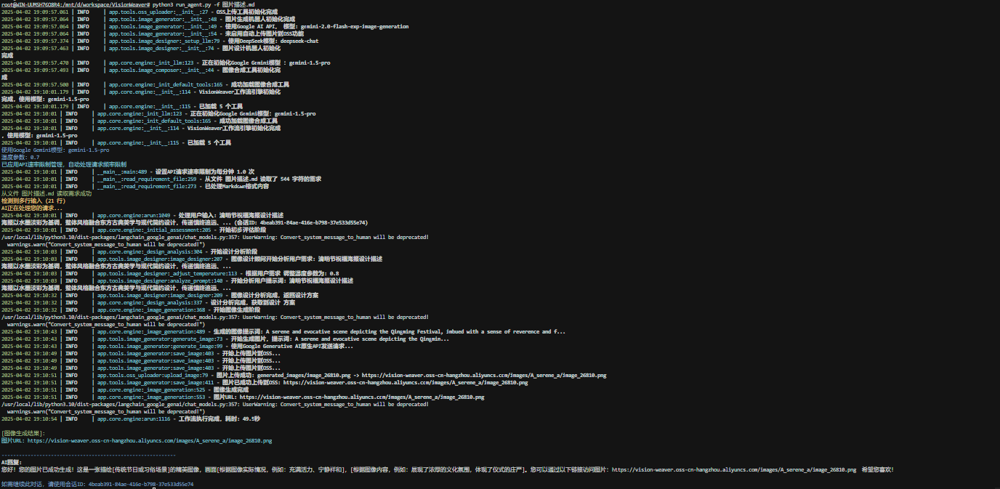

# VisionWeaver - AI图像生成与设计助手

VisionWeaver是一款基于LLM的文生图工具，可以将简单的文本描述转化为高质量图像。它区别于简单的提示词生成图片的方式，通过多阶段处理和智能任务分解，生成符合用户需求的专业设计图像。

## 它是如何工作的

当你输入一个简单的需求（如"设计一张清明节海报"）后，VisionWeaver会：

1. **分析需求** - 理解你的核心意图和设计目标
2. **设计构思** - 生成2-3个专业设计方案，包含构图、色彩和风格建议
3. **提示词优化** - 将设计方案转换为高效的图像生成提示词
4. **图像渲染** - 调用Gemini模型生成高质量图像
5. **图像合成** - 可选择性地添加您的logo或二维码到生成图像上

整个过程类似于与专业设计师协作，而非仅仅输入提示词。

## 技术栈与依赖

| 组件 | 技术 | 版本 | 用途 |
|------|------|------|------|
| **核心框架** | LangChain | 0.1.0+ | 构建LLM应用和工具调用 |
|  | LangGraph | 0.0.20+ | 实现多阶段工作流程和状态管理 |
|  | FastAPI | 0.104.0+ | 构建REST API服务 |
|  | Asyncio | Python 3.10+ | 处理异步任务和并发 |
| **模型** | Gemini-1.5-Pro | Google API | 核心理解和生成能力 |
|  | DeepSeek | Chat-7B | 图像设计分析 |
| **存储** | Aliyun OSS | SDK 2.7.0+ | 图像存储和分发 |
| **其他** | Pillow | 10.0.0+ | 图像处理和合成 |
|  | aiohttp | 3.8.5+ | 异步HTTP请求 |

## 核心功能与优势

✅ **智能图像设计**：不只是生成图像，而是提供专业设计方案  
✅ **多轮优化**：通过分阶段处理提升图像质量  
✅ **中文理解**：深度理解中文表达和文化元素  
✅ **图像合成**：支持添加水印、logo或二维码  
✅ **API与CLI双接口**：灵活对接各类应用场景  
✅ **速率限制管理**：智能处理API请求频率，避免额度浪费

## 系统架构

VisionWeaver采用模块化架构：

```
用户输入 → 意图分析 → 设计构思 → 提示词优化 → 图像生成 → 图像合成 → 输出
```

### 关键组件

- **Engine核心引擎**：协调整个工作流，管理状态和转换
- **工具集**：
  - `image_designer`: 分析需求并提供设计方案
  - `image_generator`: 调用图像生成API
  - `image_composer`: 处理图像合成和后期处理
- **接口层**：提供CLI和REST API两种接口

## 目录结构

```
VisionWeaver/
├── app/                       # 应用源码
│   ├── core/                  # 核心引擎
│   │   ├── config.py          # 配置管理
│   │   ├── engine.py          # 工作流引擎
│   │   └── __init__.py
│   ├── tools/                 # 工具模块
│   │   ├── image_designer.py  # 设计方案生成
│   │   ├── image_generator.py # 图像生成封装
│   │   ├── image_composer.py  # 图像合成处理
│   │   └── __init__.py
│   ├── utils/                 # 工具集
│   │   └── ...
│   └── main.py                # FastAPI应用入口
├── logs/                      # 日志文件
├── config/                    # 配置文件
├── requirements.txt           # 依赖清单
├── run_agent.py               # CLI入口
└── README.md                  # 使用说明
```

## 快速上手

### 1. 安装

```bash
# 克隆仓库
git clone https://github.com/yourusername/VisionWeaver.git
cd VisionWeaver

# 安装依赖
pip install -r requirements.txt
```

### 2. 配置

创建`.env`文件并设置API密钥:

```
GOOGLE_API_KEY=your_api_key_here
DEEPSEEK_API_KEY=your_api_key_here
ALIYUN_ACCESS_KEY=your_access_key
ALIYUN_SECRET_KEY=your_secret_key
ALIYUN_BUCKET_NAME=your_bucket_name
```

### 3. 运行

**命令行方式**：

```bash
# 交互模式
python run_agent.py

# 单次查询
python run_agent.py -q "设计一张春节团圆主题的贺卡"

# 文件输入（适合复杂需求）
python run_agent.py -f 设计需求.txt

# 合成logo到生成图片
python run_agent.py -q "设计一张企业宣传海报" --image logo.png

# 控制API请求速率（应对限流）
python run_agent.py --rpm 0.5  # 每120秒一次请求
```

**API服务**:

```bash
uvicorn app.main:app --reload
```
API文档访问: http://localhost:8000/docs

## 运行示例

下图展示了从输入到输出的完整流程，包括需求分析、设计方案生成和最终结果：



*命令行交互过程，展示了VisionWeaver对用户输入的分析和处理流程*

## 生成效果展示

### 清明节主题设计


*输入提示："设计一张清明节海报"。系统生成了融合传统元素与现代设计的清明节主题图像，包含柳树、祭祀路径和天人合一的意境。*

### 传统祭祀场景


*输入提示："描绘清明节祭祀场景"。系统理解了传统文化背景，生成了包含香炉、祭品和青山绿水的祭祀场景，色调和氛围符合主题。*

## 性能与限制

- **响应时间**：完整生成一张图像约15-30秒
- **图像质量**：1024×1024像素标准分辨率
- **API用量**：每次请求消耗1-2次API调用
- **限制**：
  - 免费版Google API每分钟限制2次请求
  - 每天最多50次请求
  - 不支持NSFW内容

## 未来规划

本项目将在三周内实现MCP化（Multi-Chain Programming），重点改进：

1. 将单一工作流拆分为多个独立Chain（需求分析链、设计链、生成链）
2. 增加自适应规划能力，根据用户需求动态选择工作流
3. 支持多种图像生成模型切换（DALL-E、Midjourney等）

## 许可与贡献

本项目采用MIT许可证开源

欢迎贡献代码或提出建议：
1. Fork仓库
2. 创建特性分支 (`git checkout -b feature/your-feature`)
3. 提交更改 (`git commit -m 'Add some feature'`)
4. 推送分支 (`git push origin feature/your-feature`)
5. 提交Pull Request
